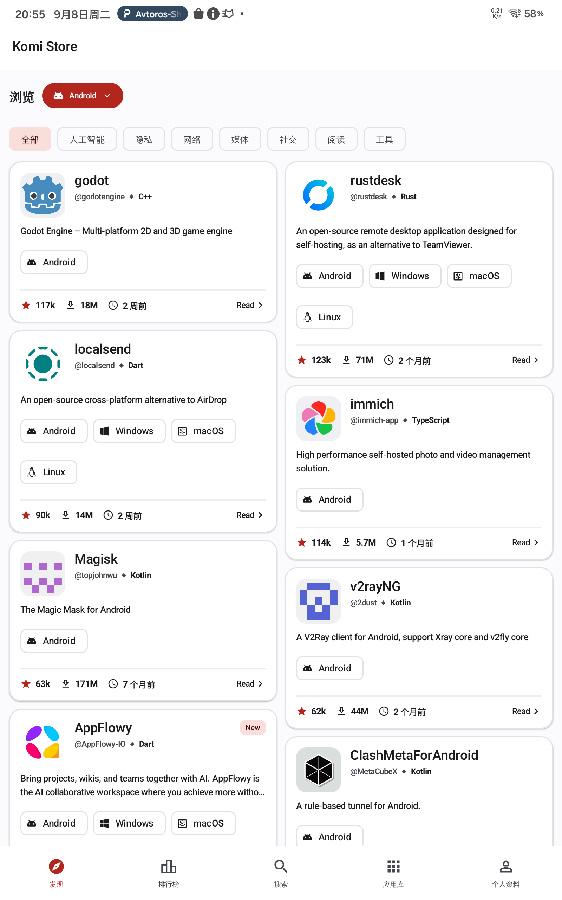
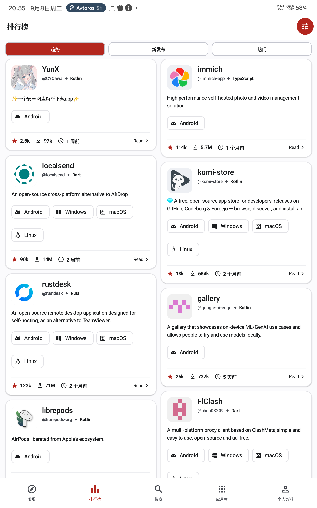
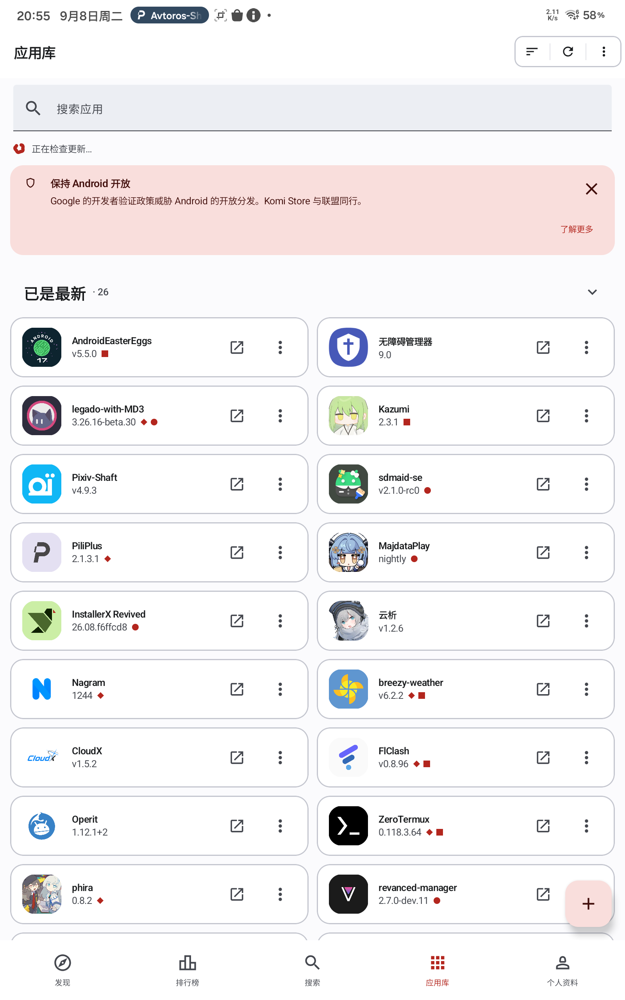

## Summary

Widen the discovery-style list screens into width-driven multi-column grids so tablets, foldables and desktop use the full canvas instead of a single stretched column.

## What changed

- **New `GridColumns` helper** (`core/presentation/layout`): `span = max(1, ceil((contentWidth − spacing) / (maxCardWidth + spacing)))` computed from `BoxWithConstraints` (the actual pane width inside list-detail, or window width single-pane). No `isTablet` branches anywhere; all five screens share one code path.
- **Charts / Feed / Search / CategoryList** → `LazyVerticalStaggeredGrid` (masonry: cards of different description lengths pack tightly, no row-height gaps).
- **Apps** → `LazyVerticalGrid` with mixed spans: banners and section headers span the full line (`GridItemSpan(maxLineSpan)`), pending/update/up-to-date app cards flow through the same formula.
- **Fixed top bars**: Home chart tabs and Feed platform/category strips moved out of the scroll container (they used `stickyHeader`); desktop Feed keeps its existing no-control-bar behavior.
- Removed the per-screen `constrainedContentWidth` caps on the migrated screens and the leftover per-item horizontal paddings; all screens now share one spacing language: 10 dp card gap, 12 dp screen edge.
- `ScrollbarContainer` / `arrowKeyScroll` gained `LazyGridState` overloads (Apps), and a `GridScrollbarAdapter` for the desktop scrollbar.

## Phone layout is unaffected

- On phone-width windows (< ~570 dp) the formula yields **1 column everywhere** — the staggered grid renders identically to the previous `LazyColumn` (same card order, 10 dp gaps, 12 dp edge padding, same keys).
- No card component internals were touched (diff contains zero changes to `KomiRepoCard`, `AppItemCard`, `CompactAppRow`, `DiscoveryRepoCard`).
- Verified on device: phone portrait renders exactly as before; only wider canvases gain columns.

## Column counts (550 dp max card width)

| Content width | Columns |
|---|---|
| ≤ 570 dp (phone portrait) | 1 |
| 700 dp (phone landscape) | 2 |
| 820 dp (tablet portrait) | 2 |
| 588 dp detail pane (tablet landscape, list-detail) | 2 |
| 1205 dp (tablet landscape full width) | 3 |

## Screenshots (tablet)

| Charts | Feed | Apps |
|---|---|---|
|  |  |  |

## How to test

1. `./gradlew :core:presentation:jvmTest` — new `GridColumnsTest` (22 anchor cases + 4 boundary clamps over the formula).
2. `./gradlew ktlintCheck :core:domain:jvmTest` — no regressions (79 existing domain tests).
3. `./gradlew :composeApp:assembleDebug` — Android + Desktop compile.
4. On device: rotate / resize — columns reflow instantly (no `animateItem` jitter); scroll keeps the first visible item index (position may shift as expected when the column count changes).

## Notes & follow-ups

- Container split rationale: masonry (StaggeredGrid) for the discovery screens vs regular grid for Apps — Apps needs `GridItemSpan` for full-line banners/headers, which StaggeredGrid does not support.
- Follow-up candidates (deliberately not in this PR): extracting a shared "grid screen scaffold" composable (the five screens still repeat a small config block), and merging the two scrollbar adapters behind a single interface.
- `AdaptiveListDetailScaffold` stays untouched; migrating it to the official Material3 adaptive library is a separate future effort.
